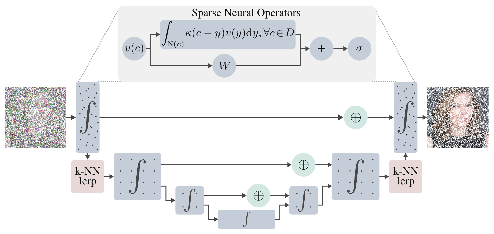

## $\infty$-Diff: Infinite Resolution Diffusion with Subsampled Mollified States
[Sam Bond-Taylor](https://samb-t.github.io/) and [Chris G. Willcocks](https://cwkx.github.io/)


### Abstract
>   *We introduce ∞-Diff, a generative diffusion model which directly operates on infinite resolution data. By randomly sampling subsets of coordinates during training and learning to denoise the content at those coordinates, a continuous function is learned that allows sampling at arbitrary resolutions. In contrast to other recent infinite resolution generative models, our approach operates directly on the raw data, not requiring latent vector compression for context, using hypernetworks, nor relying on discrete components. As such, our approach achieves significantly higher sample quality, as evidenced by lower FID scores, as well as being able to effectively scale to much higher resolutions.*



[arXiv](https://arxiv.org/abs/2303.18242) | [BibTeX](#bibtex)

### Table of Contents

- [Abstract](#abstract)
- [Table of Contents](#table-of-contents)
- [Setup](#setup)
  - [Set up conda environment](#set-up-conda-environment)
  - [Compile requirements](#compile-requirements)
  - [Dataset Set Up](#dataset-setup)
- [Commands](#commands)
  - [Training](#training)
  - [Generate Samples](#generate-samples)
- [Acknowledgement](#acknowledgement)
- [BibTeX](#bibtex)

## Setup

### Set up conda environment
The most easy way to set up the environment is using [conda](https://docs.conda.io/en/latest/). To get set up quickly, use [miniconda](https://docs.conda.io/en/latest/miniconda.html), and switch to the [libmamba](https://www.anaconda.com/blog/a-faster-conda-for-a-growing-community) solver to speed up environment solving.

The following commands assume that CUDA 11.7 is installed. If a different version of CUDA is installed, alter `requirements.yml` accordingly. Run the following command to clone this repo using [git](https://git-scm.com/book/en/v2/Getting-Started-Installing-Git) and create the environment.

```
git clone https://github.com/samb-t/infty-diff && cd infty-diff
conda env create --name infty-diff --file requirements.yml
conda activate infty-diff
```

As part of the installation [`torchsparse`](https://github.com/mit-han-lab/torchsparse) and [`flash-attention`](https://github.com/HazyResearch/flash-attention) are compiled from source so this may take a while.

By default `torchsparse` is installed for efficient sparse convolutions. This is what was used in all of our experiments as we found it performed the best; we include a depthwise convolution implementation of `torchsparse` which we found can outperform dense convolutions in some settings. However, there are other libraries available such as [`spconv`](https://github.com/traveller59/spconv) and [`MinkowksiEngine`](https://github.com/NVIDIA/MinkowskiEngine), which on your hardware may perform better so may be preferred, however, we have not thoroughly tested these. When training models, the sparse backend can be selected with `--config.model.backend="torchsparse"`.

### Dataset setup
To configure the default paths for datasets used for training the models in this repo, simply edit the config file in in the config file - changing the `data.root_dir` attribute of each dataset you wish to use to the path where your dataset is saved locally.


| Dataset   | Official Link                                                                | Academic Torrents Link |
| --------- | ---------------------------------------------------------------------------- |------------------------|
| FFHQ      | [Official FFHQ](https://github.com/NVlabs/ffhq-dataset)                      | [Academic Torrents FFHQ](https://academictorrents.com/details/1c1e60f484e911b564de6b4d8b643e19154d5809) |
| LSUN      | [Official LSUN](https://github.com/fyu/lsun)                                 | [Academic Torrents LSUN](https://academictorrents.com/details/c53c374bd6de76da7fe76ed5c9e3c7c6c691c489) |
| CelebA-HQ | [Official CelebA-HQ](https://github.com/tkarras/progressive_growing_of_gans) | - |


## Commands
This section contains details on basic commands for training and generating samples. Image level models were trained on an A100 80GB and these commands presume the same level of hardware. If your GPU has less VRAM then you may need to train with smaller batch sizes and/or smaller models than defaults.

### Training
The following command starts training the image level diffusion model on FFHQ.
```
python train_inf_ae_diffusion.py --config configs/ffhq_256_config.py --config.run.experiment="ffhq_mollified_256"
```

After which the latent model can be trained with
```
python train_latent_diffusion.py --config configs/ffhq_latent_config.py --config.run.experiment="ffhq_mollified_256_sampler" --decoder_config configs/ffhq_256_config.py --decoder_config.run.experiment="ffhq_mollified_256"
```

`ml_collections` is used for hyperparameters, so overriding these can be done by passing in values, for example, batch size can be changed with `--config.train.batch_size=32`.

### Generate samples
After both models have been trained, the following script will generate a folder of samples
```
python experiments/generate_samples.py --config configs/ffhq_latent_config.py --config.run.experiment="ffhq_mollified_256_sampler" --decoder_config configs/ffhq_256_config.py --decoder_config.run.experiment="ffhq_mollified_256"
```

## Acknowledgement
Huge thank you to everyone who makes their code available. In particular, some code is based on
- [Improved Denoising Diffusion Probabilistic Models](https://github.com/openai/improved-diffusion)
- [Diffusion Autoencoders: Toward a Meaningful and Decodable Representation](https://github.com/phizaz/diffae)
- [Fourier Neural Operator for Parametric Partial Differential Equations](https://github.com/zongyi-li/fourier_neural_operator)
- [Unleashing Transformers: Parallel Token Prediction with Discrete Absorbing Diffusion for Fast High-Resolution Image Generation from Vector-Quantized Codes](https://github.com/samb-t/unleashing-transformers)

## BibTeX
```
@article{bond2023infty,
  title       = {$\infty$-Diff: Infinite Resolution Diffusion with Subsampled Mollified States},
  author      = {Sam Bond-Taylor and Chris G. Willcocks},
  journal     = {arXiv preprint arXiv:2303.18242},
  year        = {2023}
}
```
